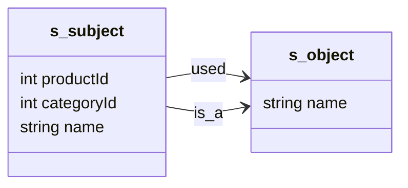
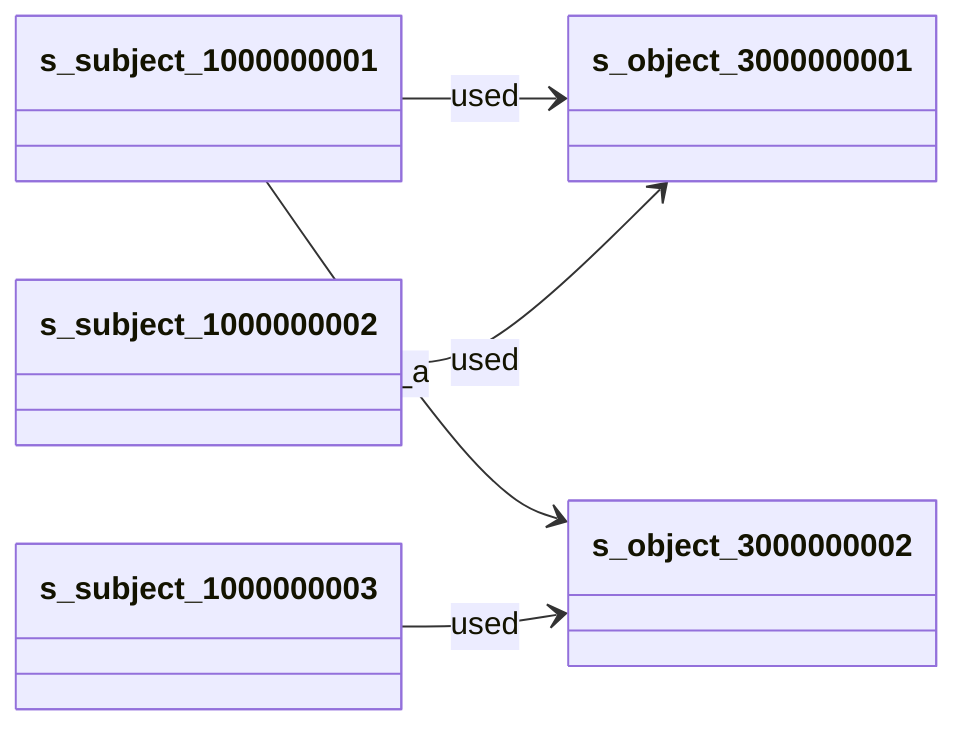

## docker 部署

按照官方教程, 首先clone nebula-docker-compose 这个仓库

```shell
git clone -b release-3.8 https://github.com/vesoft-inc/nebula-docker-compose.git
```

然后docker-compose启动

```shell
docker-compose up -d
```

这个配置文件meta, storaged, graphd都是三个进程, 一下子启动的有点多, 本地有点受不了, 看到还有一个`docker-compose-lite.yaml`文件, 里面都是只有一个, 本地测试也足够了, 于是切换成这个

```shell
docker-compose -f docker-compose-lite.yaml up -d
```

nebula有一个studia的web应用, 索性也添加到``docker-compose-lite.yaml``中, 方便查看

```yml
studia:
  image: docker.io/vesoft/nebula-graph-studio:v3.10
  environment:
    USER: root
    TZ:   "${TZ}"
  depends_on:
    - graphd
  ports:
    - 7001:7001
  networks:
    - nebula-net
  restart: on-failure
```

注意studia连接填ip的时候需要填graphd, 或者host.docker.internal


## Bug

```cypher
CREATE SPACE `test` (partition_num = 10, vid_type = FIXED_STRING(10)) 
```


```cypher
CREATE tag `s_object` (`name` string NOT NULL) ;
CREATE tag `s_subject` (`productId` int64 NOT NULL, `categoryId` int64 NOT NULL, `name` string NOT NULL) ;

CREATE edge `used` ();
CREATE edge `is_a` () ;
```



```cypher
insert vertex `s_subject`(productId, categoryId, name) values "1000000001":(1000000001, 2000000001, "project1");
insert vertex `s_subject`(productId, categoryId, name) values "1000000002":(1000000002, 2000000001, "project2");
insert vertex `s_subject`(productId, categoryId, name) values "1000000003":(1000000003, 2000000002, "project3");


insert vertex `s_object`(name) values "3000000001":("feature1");
insert vertex `s_object`(name) values "3000000002":("feature2");


INSERT EDGE used() VALUES "1000000001"->"3000000001":();
INSERT EDGE is_a() VALUES "1000000001"->"3000000002":();
INSERT EDGE used() VALUES "1000000002"->"3000000001":();
INSERT EDGE used() VALUES "1000000003"->"3000000002":();
```



查询和1000000001节点指向相同s_object的s_subject, 且指向的边类型相同.

```cypher
GO FROM "1000000001" OVER * YIELD type(edge) AS edgeType, dst(edge) AS objectId |
GO FROM $-.objectId OVER * REVERSELY WHERE type(edge) == $-.edgeType YIELD DISTINCT $$.s_subject.productId AS productId | limit 0,50


MATCH (a)-[e]->(o)
WHERE id(a) in [ "1000000001"]
with type(e) AS edgeType, id(o) AS objectId
MATCH (s)-[e2]->(o2) 
WHERE type(e2) == edgeType AND id(o2) == objectId
RETURN DISTINCT s.s_subject.productId limit 50


# in的节点不会被查出来
MATCH (a)-[e]->()<-[e2]-(b)
WHERE id(a) in [ "1000000001"] and type(e) == type(e2)
RETURN DISTINCT b.s_subject.productId limit 50
```

