## 部署

```shell
docker run -d --name rabbitmq \
    -e TZ=Asia/Shanghai \
    -e RABBITMQ_MANAGEMENT_ALLOW_WEB_ACCESS=true \
    -e RABBITMQ_SERVER_ADDITIONAL_ERL_ARGS='-rabbitmq_stream advertised_host "127.0.0.1"' \
    -v /Users/guzemin/docker/rabbitmq/mnesia:/bitnami/rabbitmq/mnesia \
    -v /Users/guzemin/docker/rabbitmq/rabbitmq.conf:/opt/bitnami/rabbitmq/etc/rabbitmq/rabbitmq.conf \
    -p 15672:15672 \
    -p 5672:5672 \
    -p 5552:5552 \
    bitnami/rabbitmq:3.13.2

# 开启stream
docker exec rabbitmq rabbitmq-plugins enable rabbitmq_stream
```


## 交换机

direct/ fanout/topic


### 备用交换机

消息推送到exchange后, 不能正确发送给队列, 可能的原因是key不对, 此时有几种可选的方案:

1. 丢弃
2. 退回给消息发送方
3. 发送给备用交换机, 由备用交换机发送给它的队列

感觉在我们的场景中, 必然是会有队列存在的.


## 队列

### 经典队列

需要通过镜像队列保证单机容错, 已不推荐


### 仲裁队列

[doc](https://www.rabbitmq.com/docs/quorum-queues)

使用raft协议保证分区容错


| 配置                        | 含义                                              |
| --------------------------- | ------------------------------------------------- |
| x-delivery-limit            | 发送次数, 超过该次数进入死信队列或丢弃, 强制      |
| x-queue-type                | quorum                                            |
| x-quorum-initial-group-size | 初始的raft组大小                                  |
| x-message-ttl               | 消息超时时间, 可以和死信队列配合实现延时队列      |
| x-single-active-consumer    | 单消费者, 意义不大, 在stream中使用                |
| x-dead-letter-exchange      | 死信交换机                                        |
| x-dead-letter-routing-key   | 死信路由key, 不配置就是消息原来的                 |
| x-dead-letter-strategy      | 默认为at-most-once, 最好是at-least-once, 否则会丢 |
| x-overflow                  | 默认为drop-head, 最好是reject-publish, 否则会丢   |
| x-max-length                | 队列长度限制, 属于运维                            |
| x-max-length-bytes          | 队列大小限制, 属于运维                            |
| x-expires                   | 队列过期时间, 不用                                |

我们肯定是不希望消息丢失, 即便是一些异常的数据, 也希望能留下痕迹, 后面能排查. 但又不希望异常消息阻塞消费者的消费, 因此delivery-limit和死信队列都应该配置.

后续可以对所有队列配同一个死信队列, 然后消费这个死信队列的消息, 对接lark的告警. 死信队列需要配置at-least-once防止丢失.


### Superstream/stream

[doc](https://www.rabbitmq.com/docs/streams)

[java stream doc](https://rabbitmq.github.io/rabbitmq-stream-java-client/stable/htmlsingle/)

和kafka很像, superstream就是由stream组成的逻辑的流, 即strean是一个kafka的partition, superstream是一个kafka的topic

需配置single-active-consumer


## spring amqp

[doc](https://docs.spring.io/spring-amqp/reference/index.html)

### 是否需要在代码中进行声明

```java
@Override
public void afterPropertiesSet() {
    List<Queue> queues = this.queues.stream().map(x -> QueueBuilder.durable(x).quorum().withArgument("x-quorum-initial-group-size", quorumReplicas).build()).toList();
    TopicExchange exchange = new TopicExchange(this.exchange);
    rabbitAdmin.declareExchange(exchange);
    for (Queue queue : queues) {
        rabbitAdmin.declareQueue(queue);
        rabbitAdmin.declareBinding(BindingBuilder.bind(queue).to(exchange).with(""));
    }
}
```

第一, 线上, 很可能应用配置的rabbitmq的用户是没有这些权限的

第二, 交换机, 队列等都是需要资源的, 创建这些时肯定要通过运维, 对rabbitmq集群资源进行预估后才能上线. 不然各个应用无序的创建, 容易导致集群出现故障

第三, 以往使用kafka和rocketmq的经验来说, topic都不是应用自动创建的


结论: 代码可以保留(?), 但是流程上, 应该是手动创建交换机和队列, 再代码开发中使用


### 发送消息是否包含在事务中

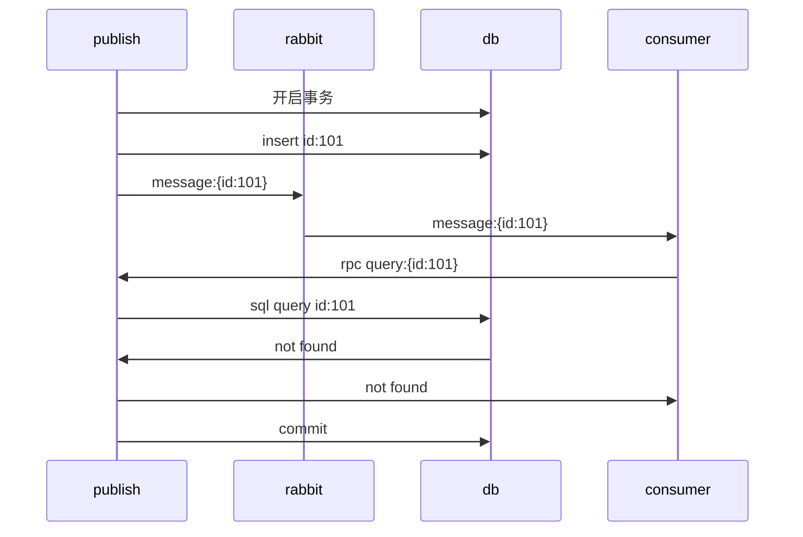

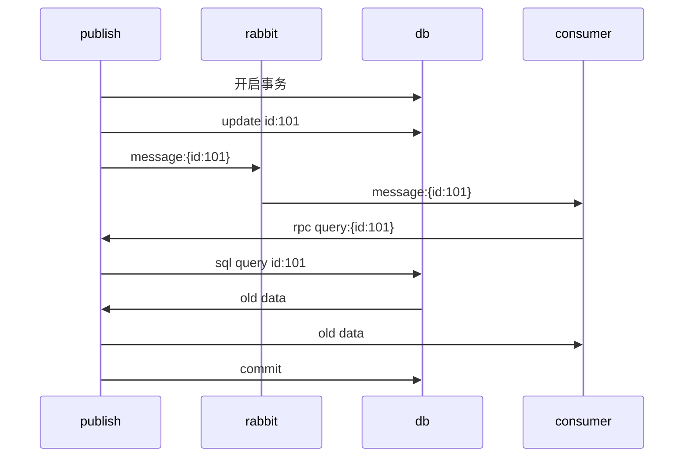


问题: 创建和修改, 都可能在发送方提交事务之前, 消费方接受到mq并进行反查, 此时就会出现查不到, 或者查到老数据的情况

结论: 即便在消息体中放了数据, 但是随着后续的迭代修改消息体, 以及新的消费方接入, 发送方是无法确定一定不会有反查的, 因此为了避免这种情况, 发送消息不能放在事务内, 需在commit之后发送. 通过日志打印等方式进行监控


#### rabbitmq 事务消息

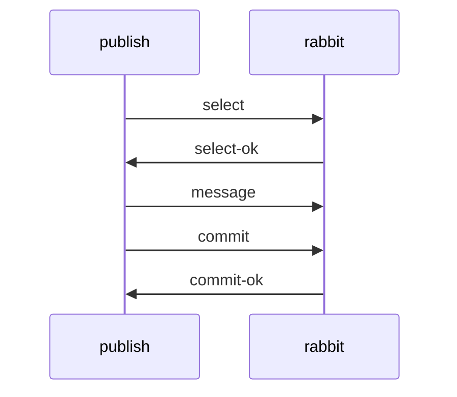

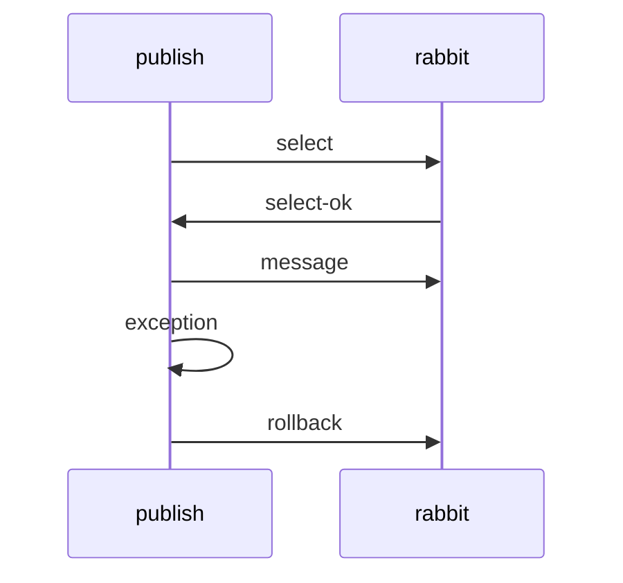

事务消息模型来自于amqp协议, 但是其性能较差, rabbitmq官方更推荐使用publish confirm模式. 而且其并不能做到XA, 因此无法和数据库事务保证一致, 存在数据库事务提交失败, rabbitmq事务提交成功, 或者rabbitmq事务提交成功, 数据库事务提交失败的问题, 所以目前感觉不推荐使用.


### 配置


#### spring.rabbitmq.publisher-confirm-type

##### SIMPLE

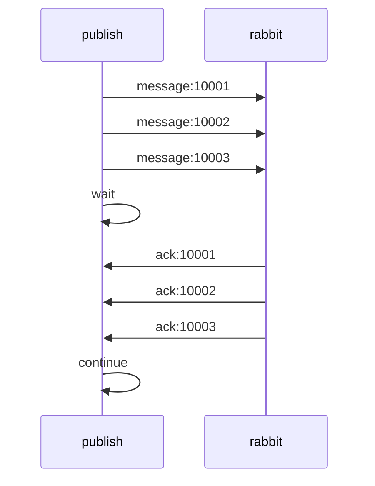


```java
rabbitTemplate.invoke(t -> {
    for (int i =0; i<10; i++) t
        t.convertAndSend("exchange", "key", "message");
    }
    t.waitForConfirmsOrDie(10_000);
    return true;
});
```

`com.rabbitmq.client.impl.ChannelN#waitForConfirms(long)`

```java
@Override
public boolean waitForConfirms(long timeout)
        throws InterruptedException, TimeoutException {
    if (nextPublishSeqNo == 0L)
        throw new IllegalStateException("Confirms not selected");
    long startTime = System.currentTimeMillis();
    synchronized (unconfirmedSet) {
        while (true) {
            if (getCloseReason() != null) {
                throw Utility.fixStackTrace(getCloseReason());
            }
            if (unconfirmedSet.isEmpty()) {
                boolean aux = onlyAcksReceived;
                onlyAcksReceived = true;
                return aux;
            }
            if (timeout == 0L) {
                unconfirmedSet.wait();
            } else {
                long elapsed = System.currentTimeMillis() - startTime;
                if (timeout > elapsed) {
                    unconfirmedSet.wait(timeout - elapsed);
                } else {
                    throw new TimeoutException();
                }
            }
        }
    }
}
```

1. `unconfirmedSet`对象存储发送且未收到rabbitmq的ack的消息id集合, 在`basicPublish`发送消息时存放消息的id, 在`handleAckNack`接收到ack或者nack时移除消息id,  `waitForConfirms`方法就是等待`unconfirmedSet`为空, 使用了wait/notify机制和rabbitmq的io线程进行通信

2. `onlyAcksReceived`标识是否只接到过ack, 如果接收到过nack那么即false


##### CORRELATED

```java
CorrelationData correlationData = new CorrelationData();  
rabbitTemplate.convertAndSend("exchange", "key", "message", correlationData);
// 异步回调, 在rabbitmq的io线程上, 因此不应执行长时间的代码, 否则会阻塞io线程
correlationData.getFuture().whenComplete((confirm, throwable) -> {
    if (confirm.isAck()) {
        log.info("Send success");
    } else {
        log.error("Send fail");
    }
});
```

`org.springframework.amqp.rabbit.connection.PublisherCallbackChannelImpl#doProcessAck`

```java
private void doProcessAck(long seq, boolean ack, boolean multiple, boolean remove) {
  if (multiple) {
    processMultipleAck(seq, ack);
  }
  else {
    Listener listener = this.listenerForSeq.remove(seq);
    if (listener != null) {
      SortedMap<Long, PendingConfirm> confirmsForListener = this.pendingConfirms.get(listener);
      PendingConfirm pendingConfirm = null;
      if (confirmsForListener != null) { // should never happen; defensive
        if (remove) {
          pendingConfirm = confirmsForListener.remove(seq);
        }
        else {
          pendingConfirm = confirmsForListener.get(seq);
        }
      }
      if (pendingConfirm != null) {
        CorrelationData correlationData = pendingConfirm.getCorrelationData();
        if (correlationData != null) {
          correlationData.getFuture().complete(new Confirm(ack, pendingConfirm.getCause()));
          if (StringUtils.hasText(correlationData.getId())) {
            this.pendingReturns.remove(correlationData.getId()); // NOSONAR never null
          }
        }
        doHandleConfirm(ack, listener, pendingConfirm);
      }
    }
    else {
      if (this.logger.isDebugEnabled()) {
        this.logger.debug(this.delegate.toString() + " No listener for seq:" + seq);
      }
    }
  }
}
```

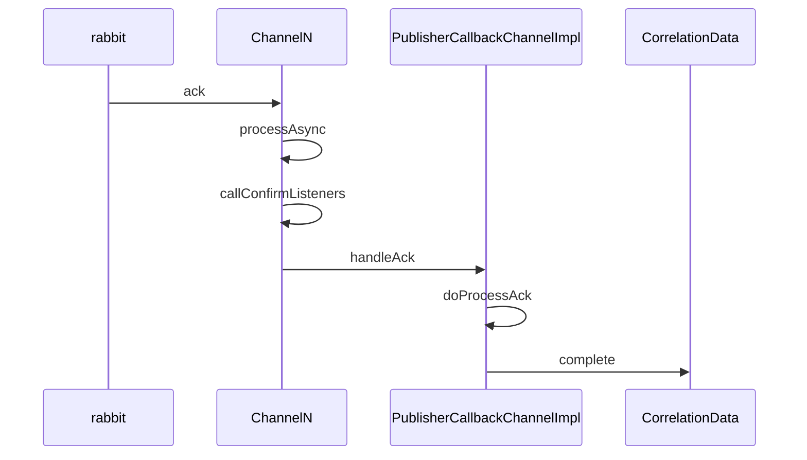


##### NONE

不进行发送确认, 不应该使用


结论: 更推荐CORRELATED这种异步发送确认的方式, 性能更高.

#### spring.rabbitmq.publisher-returns

如果消息到达交换机, 但是没有适配的队列, 也并没有备份交换机, 此时, 有两种策略, 丢弃或者返回给publish

如果返回publish那么可以通过日志等方式获得告警

但是感觉只要创建交换机和队列是前置的, 那么应该不会有这种场景

为了安全起见, 可以配置为true, 非强制

```java
correlationData.getFuture().whenComplete((confirm, throwable) -> {
    ReturnedMessage returned = correlationData.getReturned();
    if (returned != null) {
        log.warn("Return:{}" ,new String(returned.getMessage().getBody()));
    }
    if (confirm.isAck()) {
        log.info("Send success");
    } else {
        log.error("Send fail");
    }
});
```


#### spring.rabbitmq.listener.type

[doc](https://docs.spring.io/spring-amqp/reference/amqp/receiving-messages/choose-container.html)


com.rabbitmq:amqp-client:1.5.4

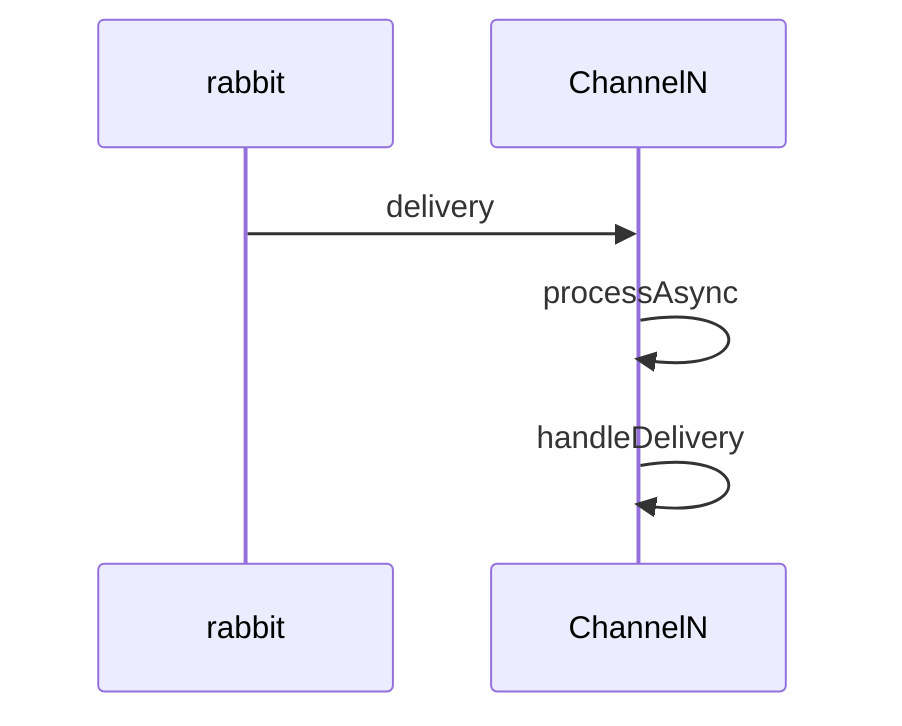

com.rabbitmq:amqp-client:5.21.0

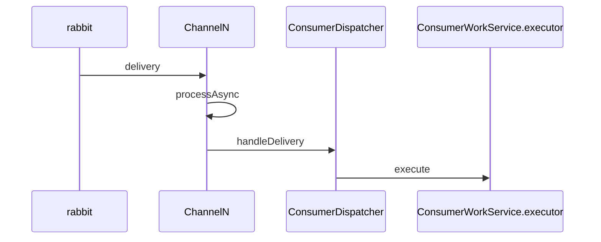

##### SIMPLE

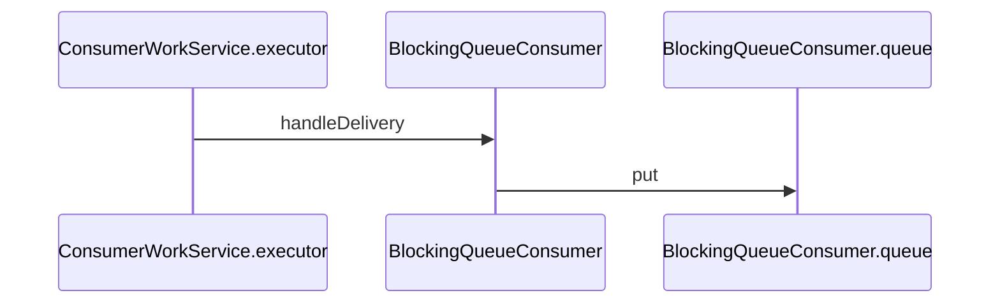

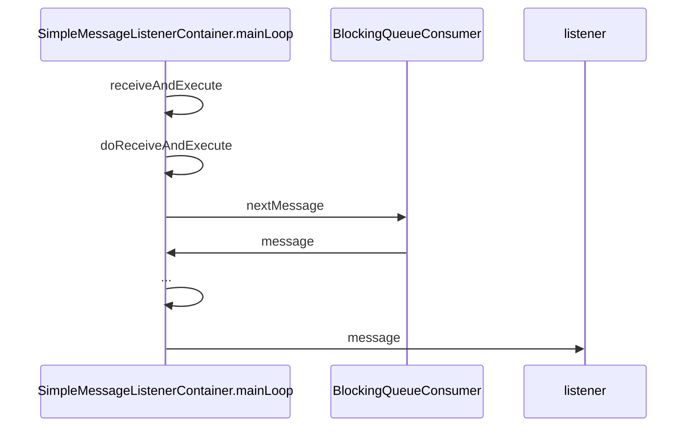

##### DIRECT

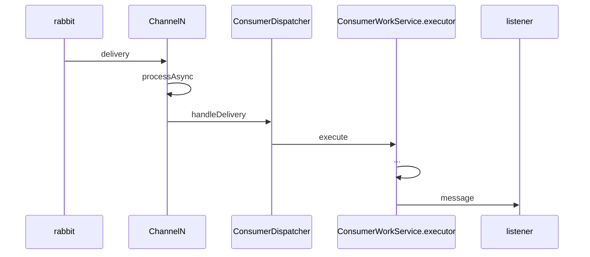


##### STREAM

略


结论: DIRECT的内存, 线程等资源消耗会更小, 除非是需要使用到simple的一些独有特性(主要是自动调整并发数量), 否则应该使用Direct. 当然这不是强制的.


#### spring.rabbitmq.listener.simple.acknowledge-mode

##### none

不推荐


##### MANUAL

需要手动进行ack或者nack

```java
@RabbitListener(queues = "queue")
public void onMessage(String message, Channel channel, @Header(AmqpHeaders.DELIVERY_TAG) long tag) throws IOException {
    log.info("Message:{}", message);
    channel.basicAck(tag, false);
}
```


##### AUTO

业务代码抛出异常就nack, 正常返回就是ack


结论: MANUAL灵活性更高, 不过AUTO也完全没问题, 按需选这两者即可. 或者配置文件中配置全局AUTO, 有需求的listener配置MANUAL


#### spring.rabbitmq.listener.direct.prefetch

rabbitmq发送给消费者的消息数量, 如果到达了这个数量, 那么rabbit就不会继续发送消息给该消费者, 直到该消费者发送ack后, 才会继续推送. 即qos, 或者叫背压.

该数值不应设置过大, 搭配上consumer的并发, 单台消费者可能会承载不了压力而挂掉, 甚至导致服务雪崩, 按照系统的能力来配置即可.


#### retry

发送和消费都有retry配置, 这都是spring的重试. 即消费的时候, 在rabbit的视角, 多次重试, 只算投递一次,  即会和队列的delivery-limit参数相乘才是最大可能的重试次数.

retry是通过spring retry模块实现的, 通过指数回退算法, 可以尽量避免因偶发的异常(网络, 数据库, redis等)导致的失败, 目前没找到rabbit推送消息有对应的配置, 它会立即重新推送, 此时如果网络没有自动恢复, 那么还是会失败, , 所以感觉还是需要配置重试的. 为了防止重试次数过多, 次数和delivery-limit不要配置过大.

## spring cloud stream rabbit

[doc](https://docs.spring.io/spring-cloud-stream/docs/current/reference/html/spring-cloud-stream-binder-rabbit.html#_reference_guide)
