## 部署

```shell
docker run -d --name rabbitmq \
    -e TZ=Asia/Shanghai \
    -e RABBITMQ_MANAGEMENT_ALLOW_WEB_ACCESS=true \
    -e RABBITMQ_SERVER_ADDITIONAL_ERL_ARGS='-rabbitmq_stream advertised_host "127.0.0.1"' \
    -v /Users/guzemin/docker/rabbitmq/mnesia:/bitnami/rabbitmq/mnesia \
    -v /Users/guzemin/docker/rabbitmq/rabbitmq.conf:/opt/bitnami/rabbitmq/etc/rabbitmq/rabbitmq.conf \
    -p 15672:15672 \
    -p 5672:5672 \
    -p 5552:5552 \
    bitnami/rabbitmq:3.13.2

# 开启stream
docker exec rabbitmq rabbitmq-plugins enable rabbitmq_stream
```


## 交换机

### direct

根据routeKey完全匹配


### topic

routeKey是a.b.c的模式, 其中*可以匹配一个单词, #匹配多个单词

匹配时根据*和#类似模糊匹配


### fanout

广播


### 备用交换机

消息推送到exchange后, 不能正确发送给队列, 可能的原因是key不对, 此时有几种可选的方案:

1. 丢弃
2. 退回给消息发送方
3. 发送给备用交换机, 由备用交换机发送给它的队列

感觉在我们的场景中, 必然是会有队列存在的.


## 队列

### 经典队列

需要通过镜像队列保证单机容错, 已不推荐


### 仲裁队列

[doc](https://www.rabbitmq.com/docs/quorum-queues)

使用raft协议保证分区容错


| 配置                        | 含义                                              |
| --------------------------- | ------------------------------------------------- |
| x-delivery-limit            | 发送次数, 超过该次数进入死信队列或丢弃, 强制      |
| x-queue-type                | quorum                                            |
| x-quorum-initial-group-size | 初始的raft组大小                                  |
| x-message-ttl               | 消息超时时间, 可以和死信队列配合实现延时队列      |
| x-single-active-consumer    | 单消费者, 意义不大, 在stream中使用                |
| x-dead-letter-exchange      | 死信交换机                                        |
| x-dead-letter-routing-key   | 死信路由key, 不配置就是消息原来的                 |
| x-dead-letter-strategy      | 默认为at-most-once, 最好是at-least-once, 否则会丢 |
| x-overflow                  | 默认为drop-head, 最好是reject-publish, 否则会丢   |
| x-max-length                | 队列长度限制, 属于运维                            |
| x-max-length-bytes          | 队列大小限制, 属于运维                            |
| x-expires                   | 队列过期时间, 不用                                |

我们肯定是不希望消息丢失, 即便是一些异常的数据, 也希望能留下痕迹, 后面能排查. 但又不希望异常消息阻塞消费者的消费, 因此delivery-limit和死信队列都应该配置.

后续可以对所有队列配同一个死信队列, 然后消费这个死信队列的消息, 对接lark的告警. 死信队列需要配置at-least-once防止丢失.


### Superstream/stream

[doc](https://www.rabbitmq.com/docs/streams)

[java stream doc](https://rabbitmq.github.io/rabbitmq-stream-java-client/stable/htmlsingle/)

和kafka很像, superstream就是由stream组成的逻辑的流, 即strean是一个kafka的partition, superstream是一个kafka的topic

需配置single-active-consumer


## spring amqp

[doc](https://docs.spring.io/spring-amqp/reference/index.html)

### 是否需要在代码中进行声明

```java
@Override
public void afterPropertiesSet() {
    List<Queue> queues = this.queues.stream().map(x -> QueueBuilder.durable(x).quorum().withArgument("x-quorum-initial-group-size", quorumReplicas).build()).toList();
    TopicExchange exchange = new TopicExchange(this.exchange);
    rabbitAdmin.declareExchange(exchange);
    for (Queue queue : queues) {
        rabbitAdmin.declareQueue(queue);
        rabbitAdmin.declareBinding(BindingBuilder.bind(queue).to(exchange).with(""));
    }
}
```

第一, 线上, 很可能应用配置的rabbitmq的用户是没有这些权限的

第二, 交换机, 队列等都是需要资源的, 创建这些时肯定要通过运维, 对rabbitmq集群资源进行预估后才能上线. 不然各个应用无序的创建, 容易导致集群出现故障

第三, 以往使用kafka和rocketmq的经验来说, topic都不是应用自动创建的


结论: 代码可以保留(?), 但是流程上, 应该是手动创建交换机和队列, 再代码开发中使用


### 发送消息是否包含在事务中

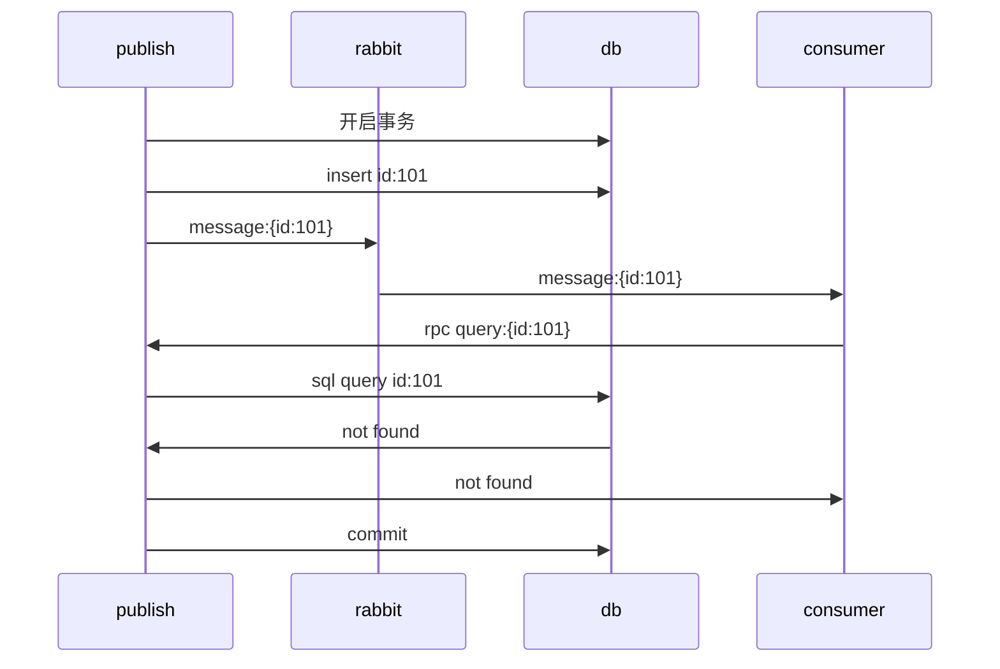
```mermaid
sequenceDiagram
    participant publish
    participant rabbit
    participant db
    participant consumer
    publish->>db: 开启事务
    publish ->>db: insert id:101
    publish->>rabbit: message:{id:101}
    rabbit ->> consumer: message:{id:101}
    consumer ->> publish: rpc query:{id:101}
    publish ->> db: sql query id:101
    db ->> publish: not found
    publish ->> consumer: not found
    publish->>db: commit
```

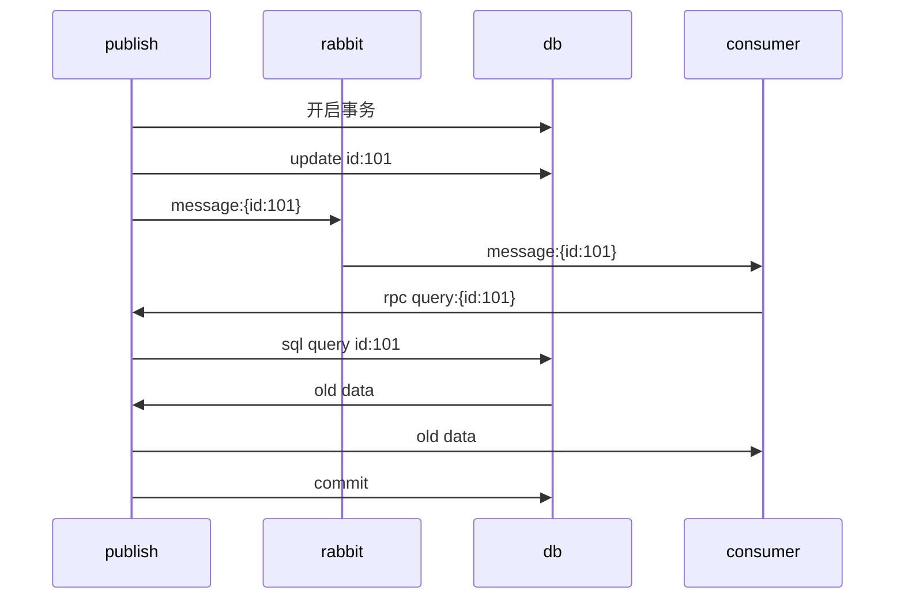
```mermaid
sequenceDiagram
    participant publish
    participant rabbit
    participant db
    participant consumer
    publish->>db: 开启事务
    publish ->>db: update id:101
    publish->>rabbit: message:{id:101}
    rabbit ->> consumer: message:{id:101}
    consumer ->> publish: rpc query:{id:101}
    publish ->> db: sql query id:101
    db ->> publish: old data
    publish ->> consumer: old data
    publish->>db: commit
```


问题: 创建和修改, 都可能在发送方提交事务之前, 消费方接受到mq并进行反查, 此时就会出现查不到, 或者查到老数据的情况

结论: 即便在消息体中放了数据, 但是随着后续的迭代修改消息体, 以及新的消费方接入, 发送方是无法确定一定不会有反查的, 因此为了避免这种情况, 发送消息不能放在事务内, 需在commit之后发送. 通过日志打印等方式进行监控


#### rabbitmq 事务消息

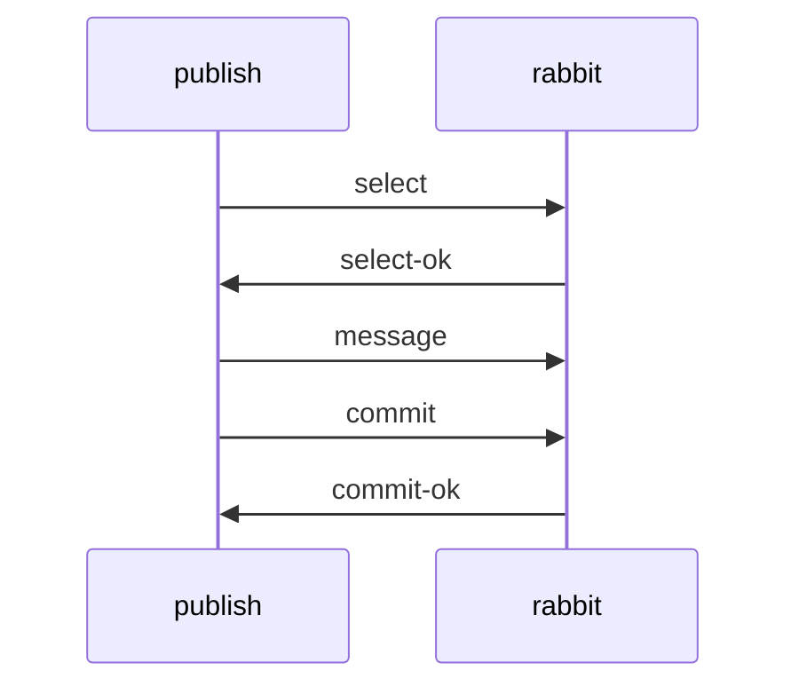
```mermaid
sequenceDiagram
    participant publish
    participant rabbit
    publish->>rabbit: select
    rabbit->>publish: select-ok
    publish->>rabbit: message
    publish ->> rabbit: commit
    rabbit->>publish: commit-ok
```

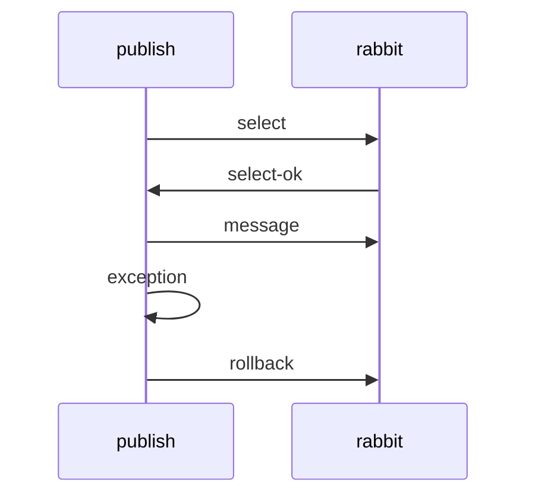
```mermaid
sequenceDiagram
    participant publish
    participant rabbit
    publish->>rabbit: select
    rabbit->>publish: select-ok
    publish->>rabbit: message
    publish->>publish: exception
    publish ->> rabbit: rollback
```

事务消息模型来自于amqp协议, 但是其性能较差, rabbitmq官方更推荐使用publish confirm模式. 而且其并不能做到XA, 因此无法和数据库事务保证一致, 存在数据库事务提交失败, rabbitmq事务提交成功, 或者rabbitmq事务提交成功, 数据库事务提交失败的问题, 所以目前感觉不推荐使用.


### 配置


#### spring.rabbitmq.publisher-confirm-type

##### SIMPLE

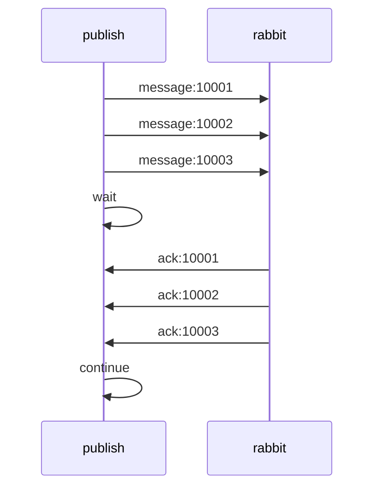
```mermaid
sequenceDiagram
    participant publish
    participant rabbit
    publish->>rabbit: message:10001
    publish->>rabbit: message:10002
    publish->>rabbit: message:10003
    publish ->> publish: wait
    rabbit->>publish: ack:10001
    rabbit->>publish: ack:10002
    rabbit->>publish: ack:10003
    publish ->> publish: continue
```


```java
rabbitTemplate.invoke(t -> {
    for (int i =0; i<10; i++) t
        t.convertAndSend("exchange", "key", "message");
    }
    t.waitForConfirmsOrDie(10_000);
    return true;
});
```

`com.rabbitmq.client.impl.ChannelN#waitForConfirms(long)`

```java
@Override
public boolean waitForConfirms(long timeout)
        throws InterruptedException, TimeoutException {
    if (nextPublishSeqNo == 0L)
        throw new IllegalStateException("Confirms not selected");
    long startTime = System.currentTimeMillis();
    synchronized (unconfirmedSet) {
        while (true) {
            if (getCloseReason() != null) {
                throw Utility.fixStackTrace(getCloseReason());
            }
            if (unconfirmedSet.isEmpty()) {
                boolean aux = onlyAcksReceived;
                onlyAcksReceived = true;
                return aux;
            }
            if (timeout == 0L) {
                unconfirmedSet.wait();
            } else {
                long elapsed = System.currentTimeMillis() - startTime;
                if (timeout > elapsed) {
                    unconfirmedSet.wait(timeout - elapsed);
                } else {
                    throw new TimeoutException();
                }
            }
        }
    }
}
```

1. `unconfirmedSet`对象存储发送且未收到rabbitmq的ack的消息id集合, 在`basicPublish`发送消息时存放消息的id, 在`handleAckNack`接收到ack或者nack时移除消息id,  `waitForConfirms`方法就是等待`unconfirmedSet`为空, 使用了wait/notify机制和rabbitmq的io线程进行通信

2. `onlyAcksReceived`标识是否只接到过ack, 如果接收到过nack那么即false


##### CORRELATED

```java
CorrelationData correlationData = new CorrelationData();  
rabbitTemplate.convertAndSend("exchange", "key", "message", correlationData);
// 异步回调, 在rabbitmq的io线程上, 因此不应执行长时间的代码, 否则会阻塞io线程
correlationData.getFuture().whenComplete((confirm, throwable) -> {
    if (confirm.isAck()) {
        log.info("Send success");
    } else {
        log.error("Send fail");
    }
});
```

`org.springframework.amqp.rabbit.connection.PublisherCallbackChannelImpl#doProcessAck`

```java
private void doProcessAck(long seq, boolean ack, boolean multiple, boolean remove) {
  if (multiple) {
    processMultipleAck(seq, ack);
  }
  else {
    Listener listener = this.listenerForSeq.remove(seq);
    if (listener != null) {
      SortedMap<Long, PendingConfirm> confirmsForListener = this.pendingConfirms.get(listener);
      PendingConfirm pendingConfirm = null;
      if (confirmsForListener != null) { // should never happen; defensive
        if (remove) {
          pendingConfirm = confirmsForListener.remove(seq);
        }
        else {
          pendingConfirm = confirmsForListener.get(seq);
        }
      }
      if (pendingConfirm != null) {
        CorrelationData correlationData = pendingConfirm.getCorrelationData();
        if (correlationData != null) {
          correlationData.getFuture().complete(new Confirm(ack, pendingConfirm.getCause()));
          if (StringUtils.hasText(correlationData.getId())) {
            this.pendingReturns.remove(correlationData.getId()); // NOSONAR never null
          }
        }
        doHandleConfirm(ack, listener, pendingConfirm);
      }
    }
    else {
      if (this.logger.isDebugEnabled()) {
        this.logger.debug(this.delegate.toString() + " No listener for seq:" + seq);
      }
    }
  }
}
```

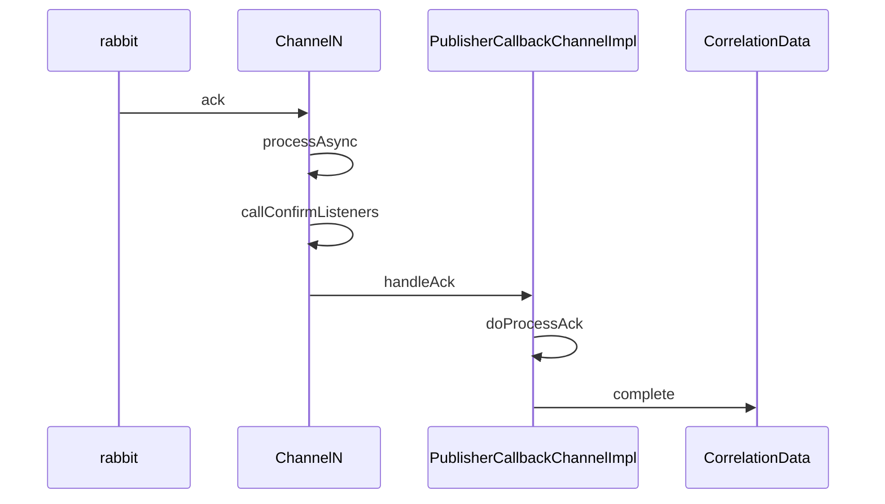
```mermaid
sequenceDiagram
    participant rabbit
    participant ChannelN
    participant PublisherCallbackChannelImpl
    participant CorrelationData
    rabbit ->> ChannelN: ack
    ChannelN ->> ChannelN: processAsync
    ChannelN ->> ChannelN: callConfirmListeners
    ChannelN ->> PublisherCallbackChannelImpl: handleAck
    PublisherCallbackChannelImpl ->> PublisherCallbackChannelImpl: doProcessAck
    PublisherCallbackChannelImpl ->> CorrelationData: complete
```


##### NONE

不进行发送确认, 不应该使用


结论: 更推荐CORRELATED这种异步发送确认的方式, 性能更高.

#### spring.rabbitmq.publisher-returns

如果消息到达交换机, 但是没有适配的队列, 也并没有备份交换机, 此时, 有两种策略, 丢弃或者返回给publish

如果返回publish那么可以通过日志等方式获得告警

但是感觉只要创建交换机和队列是前置的, 那么应该不会有这种场景

为了安全起见, 可以配置为true, 非强制

```java
correlationData.getFuture().whenComplete((confirm, throwable) -> {
    ReturnedMessage returned = correlationData.getReturned();
    if (returned != null) {
        log.warn("Return:{}" ,new String(returned.getMessage().getBody()));
    }
    if (confirm.isAck()) {
        log.info("Send success");
    } else {
        log.error("Send fail");
    }
});
```


#### spring.rabbitmq.listener.type

[doc](https://docs.spring.io/spring-amqp/reference/amqp/receiving-messages/choose-container.html)


com.rabbitmq:amqp-client:1.5.4

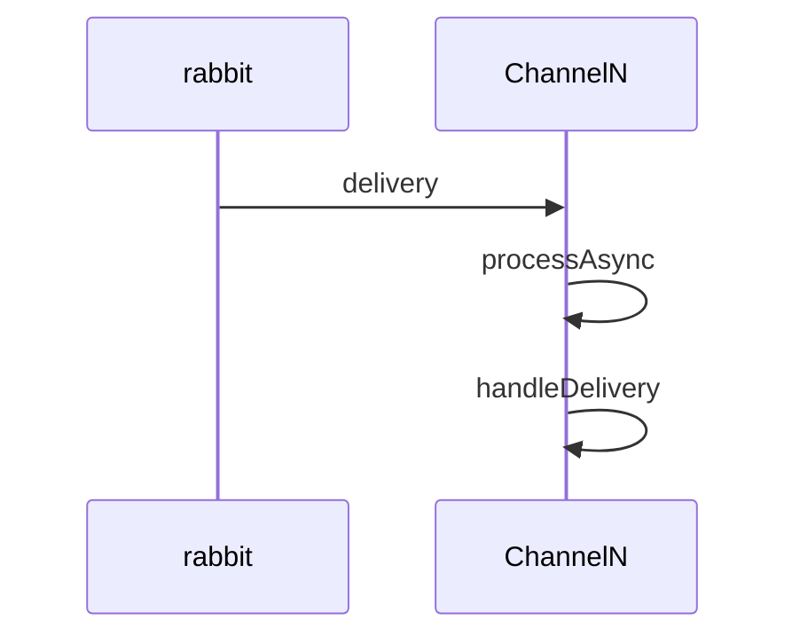
```mermaid
sequenceDiagram
    participant rabbit
    participant ChannelN
    rabbit ->> ChannelN: delivery
    ChannelN ->> ChannelN: processAsync
    ChannelN ->> ChannelN: handleDelivery
```

com.rabbitmq:amqp-client:5.21.0

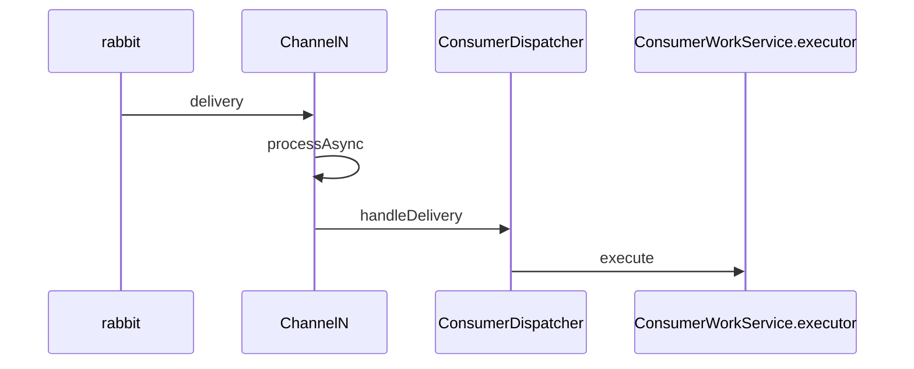
```mermaid
sequenceDiagram
    participant rabbit
    participant ChannelN
    participant ConsumerDispatcher
    participant ConsumerWorkService.executor

    rabbit ->> ChannelN: delivery
    ChannelN ->> ChannelN: processAsync
    ChannelN ->> ConsumerDispatcher: handleDelivery
    ConsumerDispatcher ->> ConsumerWorkService.executor: execute
```

##### SIMPLE

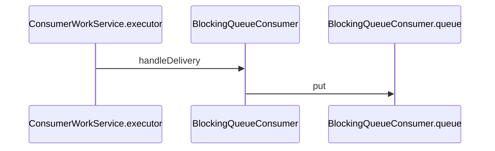
```mermaid
sequenceDiagram
    participant ConsumerWorkService.executor
    participant BlockingQueueConsumer
    participant BlockingQueueConsumer.queue
    ConsumerWorkService.executor ->> BlockingQueueConsumer: handleDelivery
    BlockingQueueConsumer ->> BlockingQueueConsumer.queue: put
```

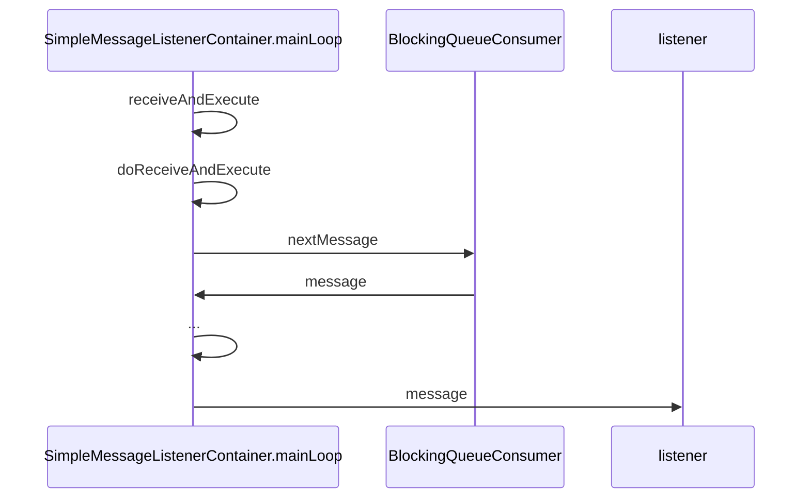
```mermaid
sequenceDiagram
    participant SimpleMessageListenerContainer.mainLoop
    participant BlockingQueueConsumer
    participant listener
    SimpleMessageListenerContainer.mainLoop ->> SimpleMessageListenerContainer.mainLoop: receiveAndExecute
    SimpleMessageListenerContainer.mainLoop ->> SimpleMessageListenerContainer.mainLoop: doReceiveAndExecute
    SimpleMessageListenerContainer.mainLoop ->> BlockingQueueConsumer: nextMessage
    BlockingQueueConsumer ->> SimpleMessageListenerContainer.mainLoop: message
    SimpleMessageListenerContainer.mainLoop ->> SimpleMessageListenerContainer.mainLoop: ...
    SimpleMessageListenerContainer.mainLoop ->> listener: message
```

##### DIRECT

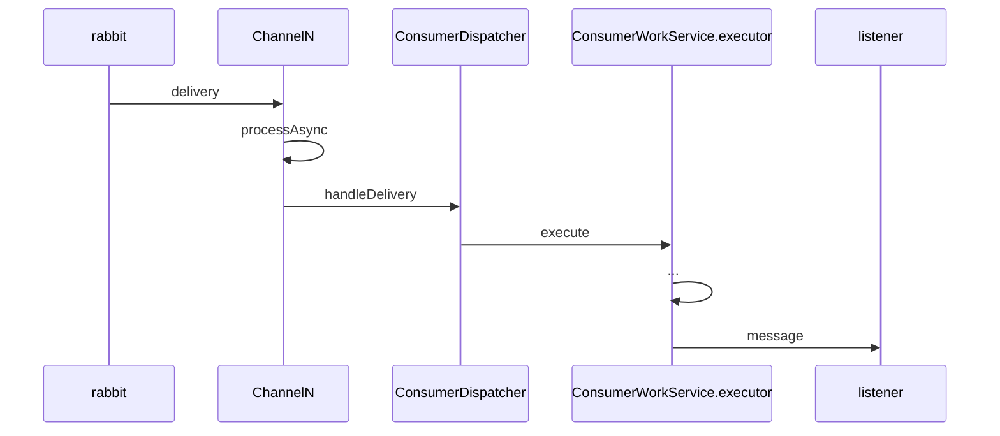
```mermaid
sequenceDiagram
    participant rabbit
    participant ChannelN
    participant ConsumerDispatcher
    participant ConsumerWorkService.executor
    participant listener
    rabbit ->> ChannelN: delivery
    ChannelN ->> ChannelN: processAsync
    ChannelN ->> ConsumerDispatcher: handleDelivery
    ConsumerDispatcher ->> ConsumerWorkService.executor: execute
    ConsumerWorkService.executor ->> ConsumerWorkService.executor: ...
    ConsumerWorkService.executor ->> listener: message
```


##### STREAM

略


结论: DIRECT的内存, 线程等资源消耗会更小, 除非是需要使用到simple的一些独有特性(主要是自动调整并发数量), 否则应该使用Direct. 当然这不是强制的.


#### spring.rabbitmq.listener.simple.acknowledge-mode

##### none

不推荐


##### MANUAL

需要手动进行ack或者nack

```java
@RabbitListener(queues = "queue")
public void onMessage(String message, Channel channel, @Header(AmqpHeaders.DELIVERY_TAG) long tag) throws IOException {
    log.info("Message:{}", message);
    channel.basicAck(tag, false);
}
```


##### AUTO

业务代码抛出异常就nack, 正常返回就是ack


结论: MANUAL灵活性更高, 不过AUTO也完全没问题, 按需选这两者即可. 或者配置文件中配置全局AUTO, 有需求的listener配置MANUAL


#### spring.rabbitmq.listener.direct.prefetch

rabbitmq发送给消费者的消息数量, 如果到达了这个数量, 那么rabbit就不会继续发送消息给该消费者, 直到该消费者发送ack后, 才会继续推送. 即qos, 或者叫背压.

该数值不应设置过大, 搭配上consumer的并发, 单台消费者可能会承载不了压力而挂掉, 甚至导致服务雪崩, 按照系统的能力来配置即可.


#### retry

发送和消费都有retry配置, 这都是spring的重试. 即消费的时候, 在rabbit的视角, 多次重试, 只算投递一次,  即会和队列的delivery-limit参数相乘才是最大可能的重试次数.

retry是通过spring retry模块实现的, 通过指数回退算法, 可以尽量避免因偶发的异常(网络, 数据库, redis等)导致的失败, 目前没找到rabbit推送消息有对应的配置, 它会立即重新推送, 此时如果网络没有自动恢复, 那么还是会失败, , 所以感觉还是需要配置重试的. 为了防止重试次数过多, 次数和delivery-limit不要配置过大.

## spring cloud stream rabbit

[doc](https://docs.spring.io/spring-cloud-stream/docs/current/reference/html/spring-cloud-stream-binder-rabbit.html#_reference_guide)

## 面试题

### RabbitMQ的核心组件是什么

Producer、Exchange、Queue、Consumer、Binding、Virtual Host、Broker

消息流程: Producer -> Exchange -> (Binding + RoutingKey) -> Queue -> Consumer

一个Broker是一个RabbitMQ实例, 一个Virtual Host是Broker内的逻辑隔离, 类似数据库中schema的概念, 不同vhost之间完全隔离, 包括交换机、队列、用户权限等。

### 交换机有哪些类型

- **direct**: RoutingKey完全匹配, 精确路由
- **topic**: RoutingKey按模式匹配, `*`匹配一个单词, `#`匹配多个单词, 最灵活
- **fanout**: 广播到所有绑定的队列, 忽略RoutingKey
- **headers**: 根据消息头属性匹配, 而非RoutingKey, 性能较差, 较少使用

实际使用中topic和fanout最常见, direct用于点对点, fanout用于广播通知。

### 如何保证消息不丢失

消息从生产到消费经过三个环节, 每个环节都可能丢失:

1. **生产者到Broker**: 开启publisher confirm机制(CORRELATED模式), Broker收到消息后回ack, 生产者据此判断是否重发
2. **Broker自身**: 消息默认存在内存中, 节点宕机会丢失。需要持久化: 交换机、队列、消息都设置durable=true。仲裁队列通过Raft协议在多节点间复制数据, 保证单节点故障不丢消息
3. **Broker到消费者**: 关闭自动ack, 使用手动ack或AUTO模式, 消费者处理完成后再ack。如果消费者在处理过程中宕机, 消息会重新投递

同时, 交换机和队列的创建应该是前置的运维操作, 避免消息到达时找不到队列。

### 如何保证消息的顺序性

RabbitMQ本身不保证全局顺序, 只保证单队列内FIFO。保证顺序性的方案:

1. **单队列单消费者**: 最简单, 但吞吐量低
2. **单队列多消费者 + prefetch=1**: 仍然是单队列, 顺序有保证, 但并发受限
3. **多队列按Key分片**: 同一业务Key的消息路由到同一队列, 如订单ID取模, 每个队列单消费者。兼顾顺序和并发

注意: 如果消费者nack导致消息重投, 仍然会破坏顺序, 需要保证消费逻辑的幂等性, 且重试时不要改变顺序。

### 如何处理消息重复消费(幂等性)

RabbitMQ不保证消息恰好一次, 网络异常、消费者宕机重启等都会导致消息重投。消费端必须保证幂等:

1. **唯一ID + 去重表**: 消息体中携带业务唯一ID, 消费前查库判断是否已处理
2. **Redis SETNX**: 用消息ID作为key写入Redis, 设置过期时间, 写入成功才消费
3. **数据库唯一约束**: 利用数据库的唯一索引兜底, 重复插入会抛异常
4. **状态机**: 业务状态流转有先后顺序, 已到终态的消息直接忽略

推荐方案: Redis去重 + 数据库唯一约束双保险。

### 什么是死信队列(DLX)

消息变成"死信"(Dead Letter)的条件:

1. 消息被消费者nack/reject且不重新入队(requeue=false)
2. 消息TTL过期
3. 队列长度达到上限, 新消息被挤出去(overflow=drop-head)

队列通过`x-dead-letter-exchange`和`x-dead-letter-routing-key`配置死信交换机, 死信会被转发到该交换机。仲裁队列建议配置`x-dead-letter-strategy=at-least-once`防止死信丢失。

常见用途: 延时队列、异常消息归档告警。

### 如何实现延时队列

RabbitMQ没有原生的延时队列, 通过以下方式实现:

1. **TTL + DLX**: 给消息或队列设置TTL, 过期后进入死信队列, 消费死信队列即实现延时。缺点: TTL基于队列设置时, 队头消息未过期会阻塞后续消息; 基于消息设置时, 同一队列中不同TTL的消息顺序不可控
2. **延时插件**(`rabbitmq_delayed_message_exchange`): 交换机级别支持延时, 消息携带`x-delay`头, 交换机到期后投递。简单直接, 但插件非官方维护
3. **stream + 时间偏移**: RabbitMQ Stream支持按时间偏移消费

实际项目中, 方案1最常用, 配合死信队列即可满足绝大多数延时场景。

### 仲裁队列和经典队列(镜像队列)的区别

| 维度          | 经典队列 + 镜像           | 仲裁队列                          |
| ------------- | ------------------------- | --------------------------------- |
| 复制协议      | GM协议, 非多数派          | Raft协议, 多数派写入              |
| 数据安全      | 异步复制, 可能丢          | 同步复制, 强一致                  |
| 脑裂处理      | 可能脑裂, 需手动处理      | Raft防脑裂, 自动恢复              |
| 性能          | 较高                      | 略低(同步开销)                    |
| 官方态度      | 已废弃, 不推荐            | 推荐, 未来主力                    |
| 配置复杂度    | 需配置镜像策略            | 创建时指定`x-queue-type=quorum`即可 |

结论: 新项目直接用仲裁队列, 老项目逐步迁移。

### 消息堆积如何处理

消息堆积说明消费速度跟不上生产速度, 解决思路:

1. **临时扩容**: 增加消费者实例, 提高并发, 快速消化堆积
2. **调大prefetch**: 提高单消费者吞吐, 但注意不要超过系统承受能力
3. **批量消费**: 改造消费逻辑, 批量写入数据库等, 提高处理效率
4. **兜底方案**: 如果堆积严重且短期无法消化, 可以新建临时队列, 将消息转发过去异步处理, 避免阻塞正常业务
5. **根因排查**: 消费者是否有慢查询、外部依赖超时、异常吞没等, 从根本上提升消费速度

### 如何实现高可用

RabbitMQ高可用从几个层面:

1. **Broker集群**: 多节点组成集群, 元数据(交换机、队列定义)在各节点间同步
2. **队列高可用**: 仲裁队列在多个节点间复制数据, 节点宕机自动选主, 数据不丢
3. **客户端故障转移**: 连接时配置多个节点地址, 客户端自动重连到健康节点
4. **配合负载均衡**: 前面挂HAProxy/Nginx做四层代理, 客户端只连LB, LB分发到健康节点
5. **监控告警**: 监控队列堆积、消费者连接数、磁盘水位等, 及时预警

### RabbitMQ和Kafka的区别

| 维度       | RabbitMQ                          | Kafka                                  |
| ---------- | --------------------------------- | -------------------------------------- |
| 设计目标   | 消息路由, 灵活投递                | 日志流, 高吞吐                         |
| 模型       | AMQP, Exchange + Queue            | Partition + Offset                     |
| 吞吐量     | 万级                              | 百万级                                 |
| 延迟       | 微秒级                            | 毫秒级                                 |
| 消息保留   | 消费即删除                        | 按策略保留, 可回放                     |
| 顺序保证   | 单队列FIFO                        | 单Partition内有序                      |
| 适用场景   | 业务消息、任务队列、RPC           | 日志收集、流处理、事件溯源             |
| 路由能力   | 强(多种交换机)                    | 弱(仅按Partition)                      |
| 运维复杂度 | 中等                              | 较高(依赖ZooKeeper/KRaft)              |

选型: 需要灵活路由、低延迟、消息优先级选RabbitMQ; 需要高吞吐、消息回放、流处理选Kafka。

### publisher confirm和事务消息的区别

| 维度     | 事务消息(tx)              | publisher confirm              |
| -------- | ------------------------- | ------------------------------ |
| 模型     | 同步, 阻塞                | 异步(推荐CORRELATED)           |
| 性能     | 差, 吞吐量下降几十倍      | 好, 几乎无损耗                 |
| 一致性   | 和DB事务无法保证XA        | 只保证消息到达Broker           |
| 官方推荐 | 不推荐                    | 推荐                           |

两者都只能保证消息到达Broker, 不能和数据库事务保证最终一致性。生产环境中, 消息发送应在数据库事务commit之后, 通过confirm机制确保到达, 配合日志监控兜底。

### prefetch的作用和如何设置

prefetch(QoS)限制RabbitMQ向单个消费者推送的未ack消息数量。达到上限后, RabbitMQ停止推送, 直到消费者ack后继续。

- **过小**: 消费者频繁等待, 吞吐量低
- **过大**: 消费者内存压力大, 可能导致OOM或处理延迟; 多消费者时负载不均

设置建议: 根据单条消息处理耗时和消费者能力调整, 通常10-50。如果消费逻辑涉及IO(数据库、RPC), 可适当调大; 如果是纯计算, 调小。配合消费者并发数综合评估, 避免单机承载过载导致雪崩。

### 消费者宕机后未ack的消息怎么处理

消费者连接断开或宕机时, RabbitMQ会感知到连接关闭, 将该消费者所有未ack的消息重新变为Ready状态, 重新投递给其他存活的消费者。

这就是为什么不能在消息接收后立即ack, 必须在业务处理完成后再ack——否则处理过程中宕机, 消息就丢了。

如果消费者处理完成但ack还未发出就宕机, 消息会被重投, 此时需要消费端幂等来避免重复处理。

### RabbitMQ的内存和磁盘水位

RabbitMQ默认将消息存在内存中以提高性能, 但有以下机制防止资源耗尽:

1. **内存水位(mem)**: 默认机器内存的40%(可通过`vm_memory_high_watermark`配置), 达到后Broker会阻塞publisher, 不再接收消息
2. **磁盘水位(disk)**: 默认50MB(`disk_free_limit`), 磁盘剩余低于该值时也会阻塞publisher, 防止磁盘写满
3. **page-out**: 内存紧张时, 消息会刷到磁盘, 性能下降

运维要点: 监控内存和磁盘水位, 合理配置阈值; 投递速率不应超过消费速率, 否则堆积会触发水位限制导致整个Broker拒收消息。
