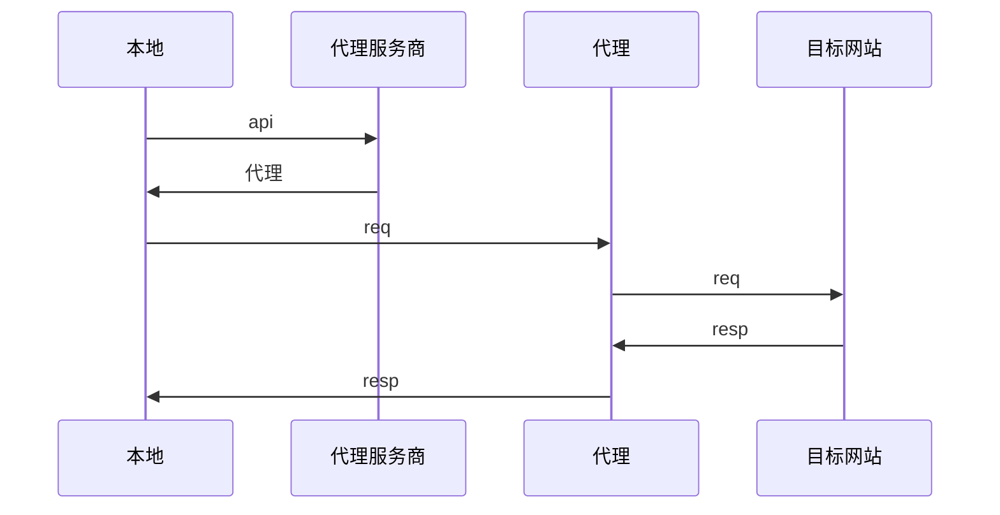
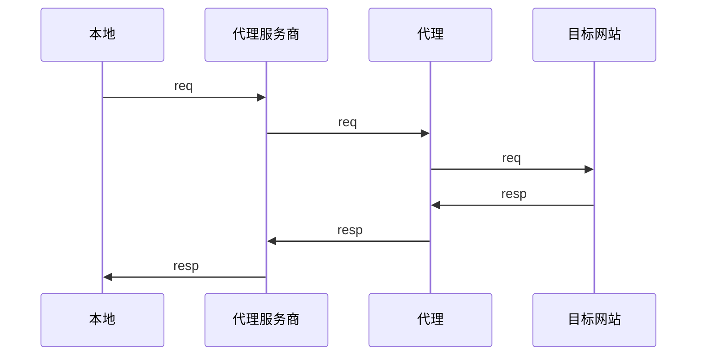

## 抓包

爬虫的第一步肯定是抓包分析请求和数据

### Chrome devtool

### Charles

https

charles可以通过中间人攻击的形式对https请求进行抓包

### wireshark

## Http

爬虫当然需要对http协议有所了解

### Code

#### 30x

Redirect

### Header

#### Gzip

#### Cookie

#### Agent

有些网站需要手机端的agent

### Htmlencode

### Urlencode

url编码

## 解析

### Jsonpath

json数据可以通过jsonpath

### Xpath


### Regex


## 反爬

### Js

graalvm js-scriptengine

有些网站需要加签, 虽然目前碰到的两个网站加签方式就是md5, 不过如果不是, 那么也可以将js拷贝下来, 通过js引擎进行调用

### Selenium

#### chromedriver

| option                                                       |                                                              |
| ------------------------------------------------------------ | ------------------------------------------------------------ |
| --no-sandbox                                                 | 禁用沙箱模式                                                 |
| --disable-dev-shm-usage                                      | 禁用 /dev/shm                                                |
| --headless                                                   | 无头模式                                                     |
| --disable-blink-features=AutomationControlled                | AutomationControlled 特性通常用于标记浏览器是由自动化工具控制的。禁用这个特性可以帮助隐藏浏览器的自动化行为，减少被网站检测到的风险 |
| --incognito                                                  | 启用无痕浏览模式                                             |
| options.setExperimentalOption("excludeSwitches", Collections.singletonList("enable-automation")); | 排除它可以帮助避免某些自动化检测                             |
| options.setExperimentalOption("useAutomationExtension", false); | 禁用自动化扩展。默认情况下，Selenium WebDriver 会加载一个自动化扩展，该扩展可能会被一些网站检测到。禁用此扩展可以减少被检测的风险 |

对浏览器进行伪装

```java
Map<String, Object> param = new HashMap<>(1);
param.put("source", "Object.defineProperties(navigator,{ webdriver:{get: () => false } })");
((HasCdp) webDriver).executeCdpCommand("Page.addScriptToEvaluateOnNewDocument", param);
```

举简单的一个例子, 找到页面的搜索框, 进行输入搜索

```java
public static void input(WebDriver webDriver, String text) {
  	// 发起请求
    webDriver.get("xxx");
    Actions actions = new Actions(webDriver);
    // 叉掉可能出现的弹窗
    try {
        Wait<WebDriver> wait = new WebDriverWait(webDriver, Duration.ofSeconds(1));
        WebElement close = wait.until(ExpectedConditions.visibilityOfElementLocated(By.className("close")));
        actions.click(close).perform();
        actions.release().perform();
    } catch (Exception e) {
        // do nothing
    }
  	// 找到数据框进行输入
    WebElement input  = webDriver.findElement(By.id("search-input"));
    actions.click(input).perform();
    actions.sendKeys(text).perform();
    actions.release().perform();
		// 点击搜索按钮
    WebElement button = webDriver.findElement(By.className("search-btn"));
    actions.click(button).perform();
    actions.release().perform();
}
```


#### browsermob

有一个网站页面上没有需要的数据, 但其实响应中有, 那么可以通过browsermob进行代理获取请求数据

```xml
<dependency>
    <groupId>net.lightbody.bmp</groupId>
    <artifactId>browsermob-core</artifactId>
    <version>2.1.5</version>
</dependency>
```

首先初始化BrowserMobProxyServer, 将监听的本地端口地址作为代理传入driver option, 再启动driver

```java
BrowserMobProxyServer proxy = new BrowserMobProxyServer();
// 启动BrowserMobProxy
proxy.start(0);
// 按需设置抓包的内容
proxy.enableHarCaptureTypes(CaptureType.REQUEST_CONTENT, CaptureType.RESPONSE_CONTENT);
// 转换成selenium driver的代理对象
String proxyStr = String.format("%s:%d", "localhost", proxy.getPort());
org.openqa.selenium.Proxy seleniumProxy = new Proxy();
seleniumProxy.setProxyType(Proxy.ProxyType.MANUAL);
seleniumProxy.setHttpProxy(proxyStr);
seleniumProxy.setSslProxy(proxyStr);

// 在driver option中传入
options.setAcceptInsecureCerts(true);
if (proxy != null) {
    options.setProxy(proxy);
}
```

```java
public void test(WebDriver webDriver, BrowserMobProxyServer proxy) {
  try {
    // 开始抓包
    proxy.newHar("xxx.com");
    // 请求
    webDriver.get("https://www.xxx.com/");
    // 获取请求数据
    proxy.getHar().getLog().getEntries()
  } finally {
      proxy.endHar();
  }
}
```


### Proxy

有些网站会封ip, 此时就需要进行代理. 一开始尝试过一些免费的代理, 太浪费时间了, 还是买个收费的节约生命吧.

一般有Api和隧道两种方式. api需要开发成本, 即对接api, 内部维护代理ip池, 及时剔除不可用的代理, 但是一般并发可以更高. 隧道更简单, 并发一般较低.






### 验证码

一些简单的验证码, 例如滑块, 可以通过selenium模拟

```java
WebElement slide = webDriver.findElement(By.className("btn_slide"));
// 创建Actions对象
Actions actions = new Actions(webDriver);
// 开始按住元素并滑动
actions.clickAndHold(slide).perform();
actions.moveByOffset(totalOffset, 20).perform();
actions.release(slide);
```

如果是复杂的滑动图案, 可以在github上解决方案, 不过太复杂的并没有可行的方案.

目前没有什么好的方法, 我都是通过debug的方式, 打好断点, 在判断出现验证码进入断点, 然后人工在浏览器上进行验证, 验证完成, 拿到一些cookie, 放开断点继续爬.


### 登录认证

一些网站会封账号, 那没有别的方法, 就是购买账号.

二维码扫码登录的, 可以首先拿到二维码的url, 将url转成字符形式的二维码, 然后通过发消息发出来, 收到消息后人工进行扫码


## 数据处理

### Ocr

像淘宝商品的详情很多都是带文字的图片, 那么需要ocr进行解析

不过java原生是通过spi的方式找到`ImageReader`的实现类, 去支持不同格式的图片的, 要找找各种解析图片类型的包

#### Tesseract

```xml
<dependency>
    <groupId>net.sourceforge.tess4j</groupId>
    <artifactId>tess4j</artifactId>
    <version>5.13.0</version>
</dependency>
```

#### 飞桨

https://aistudio.baidu.com/community/app/182491/webUI


### Translate

爬的网站是英文的, 需要进行翻译, 调用一些翻译的api即可

也可以调用ai大模型进行翻译

### 二维码识别

有时候需要识别爬到的图片的二维码

#### wechat opencv

```xml
<dependency>
    <groupId>org.bytedeco</groupId>
    <artifactId>javacpp</artifactId>
    <version>1.5.7</version>
    <classifier>${bytedeco.classifier}</classifier>
</dependency>
<dependency>
    <groupId>org.bytedeco</groupId>
    <artifactId>openblas</artifactId>
    <version>0.3.19-1.5.7</version>
    <classifier>${bytedeco.classifier}</classifier>
</dependency>
<dependency>
    <groupId>org.bytedeco</groupId>
    <artifactId>opencv</artifactId>
    <version>4.5.5-1.5.7</version>
</dependency>
<dependency>
    <groupId>org.bytedeco</groupId>
    <artifactId>opencv</artifactId>
    <version>4.5.5-1.5.7</version>
    <classifier>${bytedeco.classifier}</classifier>
</dependency>
```

```java
public void decode(String filePath) {
  try (
          Mat img = imread(filePath);
          WeChatQRCode we = new WeChatQRCode();
          StringVector stringVector = we.detectAndDecode(img)) {

     // stringVector
  }
}
```


#### zxing

```xml
<dependency>
    <groupId>com.google.zxing</groupId>
    <artifactId>javase</artifactId>
    <version>${zxing.version}</version>
</dependency>
```

```java
public List<String> decode(String filePath) {
  try {
      QRCodeMultiReader formatReader = new QRCodeMultiReader();
      BufferedImage bufferedImage = ImageIO.read(new File(filePath));
      BinaryBitmap binaryBitmap =
              new BinaryBitmap(new HybridBinarizer(new BufferedImageLuminanceSource(bufferedImage)));
      // 定义二维码参数
      Map hints = new HashMap<>(1);
      hints.put(EncodeHintType.CHARACTER_SET, "utf-8");
      com.google.zxing.Result[] result = formatReader.decodeMultiple(binaryBitmap, hints);
      return Arrays.stream(result).map(Result::getText).toList();
  } catch (NotFoundException e) {
      return Collections.emptyList();
  } catch (Exception e) {
      log.error("Unknown exception in zxing recognition of QR code:{}", filePath, e);
      return Collections.emptyList();
  }
}
```


### 同步

爬虫表太大了, 难以分析, 可以通过flinkcdc同步到starrocks

Flinkcdc

Starrocks
