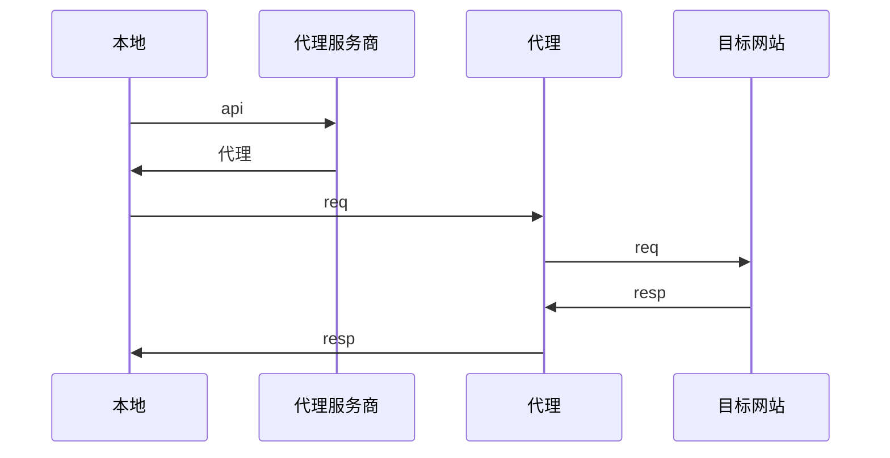
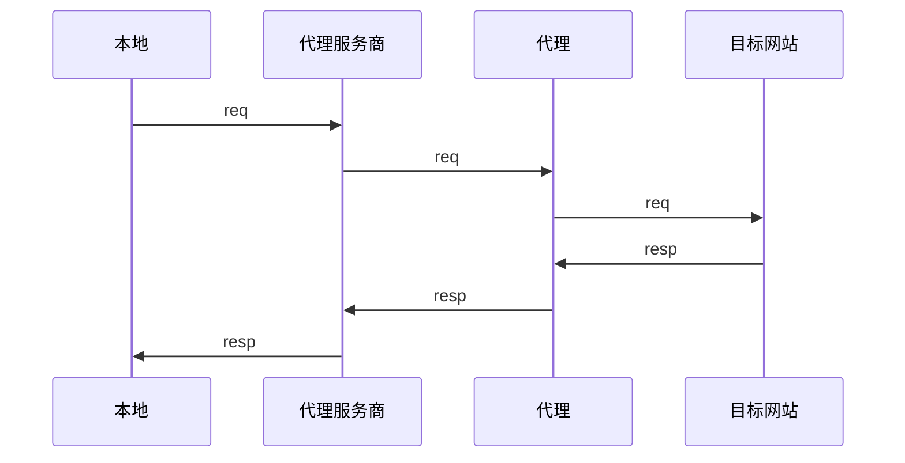

## 抓包

爬虫的第一步肯定是抓包分析请求和数据

### Chrome devtool


#### 修改js

在爬1688搜索接口的时候, 发现它是有加签校验的, get请求url如下

```sh
https://p4psearch.1688.com/hamlet/async/v1.json?beginpage=2&asyncreq=3&keywords=&keyword=%E6%B1%BD%E8%BD%A6%E5%96%87%E5%8F%AD%2F%E9%AB%98%E9%9F%B3%E5%A4%B4&sortType=&descendOrder=&province=&city=&priceStart=&priceEnd=&dis=&ptid=hr07708c007bd9c6&exp=pcCpxGuessExp%3AA%3Bqztf%3AE%3Bwysiwyg%3AA%3BpcSemWwClick%3AA&cosite=bingjj_pz&salt=17331965706772&sign=81523fd670a350647b8b2dcd17cdb3dd&hmaTid=3&hmaQuery=graphDataQuery&pidClass=pc_list_336&cpx=cpc%2Cfree%2Cnature&api=pcSearch
```

找了一遍js文件, 相关代码如下:

```js
getGraphList: o.default.mark((function e(t, n, i) {
                var l, f, d, p, h, v, y, m, g, b, w, _, x, O, E, C = n.put, S = n.call;
                return o.default.wrap((function(e) {
                    for (; ; )
                        switch (e.prev = e.next) {
                        case 0:
                            return l = (new Date).getTime(),
                            f = "" + l + parseInt(10 * Math.random()),
                            // 修改的内容
                            console.log(d),
                            d = "pcsem" + i.formParams.keyword + f + "csb44T%34CiKj&FyRbCBJ",
                            p = (0,
                            u.md5)(d),
                            h = "",
                            v = pageConfig,
                            y = v.exp,
                            m = c(y || ""),
                            ["D", "H"].includes(m.qztf) ? h = "cpc,nature" : "E" == m.qztf ? h = "cpc,free,nature" : "F" == m.qztf && (h = "cpc,cpt,cpm,free,nature"),
                            g = (0,
                            s.getUrlParms)(),
                            b = Object.assign({}, i.formParams, t.payload, (0,
                            r.default)({
                                exp: window.pageConfig.exp,
                                cosite: window.p4pObject && window.p4pObject.cosite,
                                salt: f,
                                sign: p,
                                hmaTid: 3,
                                hmaQuery: "graphDataQuery",
                                pidClass: "pc_list_336",
                                cpx: h,
                                api: "pcSearch"
                            }, "cosite", window.p4pObject && window.p4pObject.cosite)),
                            window.pageConfig && window.pageConfig._hamlet_new_ad_supply_pc_ && (b._hamlet_new_ad_supply_pc_ = window.pageConfig._hamlet_new_ad_supply_pc_),
                            1 == g._debugMode_ && (b.debug = !0),
                            w = i.formParams,
                            e.next = 15,
                            C("offer/setValues", {
                                isLoading: !0
                            });
                }
                ), e, this, [[15, 32]])
            }
```

其中salt是当前时间戳, 再加一个随机的数字. ` d = "pcsem" + i.formParams.keyword + f + "csb44T%34CiKj&FyRbCBJ",`sign是一个MD5, 入参一些是固定的字符串, salt, 还有一个keyword, 这里可以简单看出来keyword就是搜索的关键词. 但有些情况下不一定能这么直观的看出来, 这时候最好是可以console打印一下, 那么就需要修改js.

[相关博客](https://cloud.tencent.com/developer/article/1563717)

1. 在source中找到对应的js, 并保存到本地, 然后对其修改
2. 本地创建一个空文件夹, 名字随意
3. 在空文件夹中创建和js目录结构一模一样的文件夹结构, 例如 `g.alicdn.com/assets-group/pc-sem/1.0.156/pages/home/index.js`, 把修改的js放到该目录下
4. source左侧打开Overrides, 选中第二部的空文件夹, 需要同意一下, 然后可以看到激活状态的图表
5. 然后刷新页面即可成功执行被修改后的js


### Charles

可以对手机抓包

可以通过中间人攻击的形式对https请求进行抓包

### wireshark

功能更强大, 之前分析dubbo协议的时候用过

## Http

爬虫当然需要对http协议有所了解

### method

主要就是get, post

虽然说restful, 但是爬了很多网站都很少见

还有一个connect, 遇到这种情况不知道怎么抓包

### Code

#### 30x

Redirect

### Header

#### Gzip

#### Cookie

#### Agent

模拟真实请求

有些网站需要手机端的agent

### Htmlencode

### Urlencode

url编码, 注意jdk的`URLEncoder`会将空格编码成 **+**, spring带的`UriUtils`才会将空格编码成 **%20**

## 解析

### Jsonpath

json数据可以通过jsonpath

### Xpath


### Regex


## 框架

[webmagic](https://webmagic.io/)

其实也没必要, 基本通过`httpclient`或者`okhttp`即可


## 存储

爬到的数据,  经常会有新增需求的情况, 过几天说还要页面上的其他字段, 为了不重新爬, 只能将页面保存下来, 但是如果是html, 数据库存储空间根本不够, 只能存到对象存储中. 为了节约对象存储的空间和带宽, 可以压缩后存储, 压缩方式最好是gzip这种浏览器支持的, 那么可以直接在浏览器上查看, 在存储对象存储时添加Content-Encoding=gzip header即可.


## 反爬

### Js

graalvm js-scriptengine

有些网站会有加签校验, 虽然目前碰到的两个网站加签方式就是md5, 不过如果不是, 那么也可以将js拷贝下来, 通过js引擎进行调用

```xml
<dependency>
    <groupId>org.graalvm.js</groupId>
    <artifactId>js-scriptengine</artifactId>
    <version>23.0.4</version>
</dependency>
<dependency>
    <groupId>org.graalvm.js</groupId>
    <artifactId>js</artifactId>
    <version>23.0.4</version>
</dependency>
```

```java
public static String jsSign(String param) {
    try (Context context = Context.newBuilder().option("engine.WarnInterpreterOnly", "false").build()) {
        String js = FileUtils.readFileToString(
                new File("xxx/sign.js"), StandardCharsets.UTF_8);
        Value jsFunction = context.eval("js", js);
        Value sign = jsFunction.execute(param);
        return sign.asString();
    } catch (Exception e) {
        throw new RuntimeException(e);
    }
}
```


### Selenium

#### chromedriver

| option                                                       |                                                              |
| ------------------------------------------------------------ | ------------------------------------------------------------ |
| --no-sandbox                                                 | 禁用沙箱模式                                                 |
| --disable-dev-shm-usage                                      | 禁用 /dev/shm                                                |
| --headless                                                   | 无头模式                                                     |
| --disable-blink-features=AutomationControlled                | AutomationControlled 特性通常用于标记浏览器是由自动化工具控制的。禁用这个特性可以帮助隐藏浏览器的自动化行为，减少被网站检测到的风险 |
| --incognito                                                  | 启用无痕浏览模式                                             |
| options.setExperimentalOption("excludeSwitches", Collections.singletonList("enable-automation")); | 排除它可以帮助避免某些自动化检测                             |
| options.setExperimentalOption("useAutomationExtension", false); | 禁用自动化扩展。默认情况下，Selenium WebDriver 会加载一个自动化扩展，该扩展可能会被一些网站检测到。禁用此扩展可以减少被检测的风险 |

##### 对浏览器进行伪装

```java
Map<String, Object> param = new HashMap<>(1);
param.put("source", "Object.defineProperties(navigator,{ webdriver:{get: () => false } })");
((HasCdp) webDriver).executeCdpCommand("Page.addScriptToEvaluateOnNewDocument", param);
```

举简单的一个例子, 找到页面的搜索框, 进行输入搜索

```java
public static void input(WebDriver webDriver, String text) {
  	// 发起请求
    webDriver.get("xxx");
    Actions actions = new Actions(webDriver);
    // 叉掉可能出现的弹窗
    try {
        Wait<WebDriver> wait = new WebDriverWait(webDriver, Duration.ofSeconds(1));
        WebElement close = wait.until(ExpectedConditions.visibilityOfElementLocated(By.className("close")));
        actions.click(close).perform();
        actions.release().perform();
    } catch (Exception e) {
        // do nothing
    }
  	// 找到数据框进行输入
    WebElement input  = webDriver.findElement(By.id("search-input"));
    actions.click(input).perform();
    actions.sendKeys(text).perform();
    actions.release().perform();
		// 点击搜索按钮
    WebElement button = webDriver.findElement(By.className("search-btn"));
    actions.click(button).perform();
    actions.release().perform();
}
```


#### browsermob

有一个网站页面上没有需要的数据, 但其实响应中有, 那么可以通过browsermob进行代理获取请求数据

```xml
<dependency>
    <groupId>net.lightbody.bmp</groupId>
    <artifactId>browsermob-core</artifactId>
    <version>2.1.5</version>
</dependency>
```

首先初始化BrowserMobProxyServer, 将监听的本地端口地址作为代理传入driver option, 再启动driver

```java
BrowserMobProxyServer proxy = new BrowserMobProxyServer();
// 启动BrowserMobProxy
proxy.start(0);
// 按需设置抓包的内容
proxy.enableHarCaptureTypes(CaptureType.REQUEST_CONTENT, CaptureType.RESPONSE_CONTENT);
// 转换成selenium driver的代理对象
String proxyStr = String.format("%s:%d", "localhost", proxy.getPort());
org.openqa.selenium.Proxy seleniumProxy = new Proxy();
seleniumProxy.setProxyType(Proxy.ProxyType.MANUAL);
seleniumProxy.setHttpProxy(proxyStr);
seleniumProxy.setSslProxy(proxyStr);

// 在driver option中传入
options.setAcceptInsecureCerts(true);
if (proxy != null) {
    options.setProxy(proxy);
}
```

```java
public void test(WebDriver webDriver, BrowserMobProxyServer proxy) {
  try {
    // 开始抓包
    proxy.newHar("xxx.com");
    // 请求
    webDriver.get("https://www.xxx.com/");
    // 获取请求数据
    proxy.getHar().getLog().getEntries()
  } finally {
      proxy.endHar();
  }
}
```


#### remote driver

https://www.selenium.dev/documentation/webdriver/drivers/remote_webdriver/

https://github.com/SeleniumHQ/docker-selenium

```shell
docker run -d -p 4444:4444 -p 7900:7900 --shm-size="2g" --name chromium \
-e SE_NODE_MAX_SESSIONS=4 \
-e SE_NODE_SESSION_TIMEOUT=30 \
-e SE_ENABLE_BROWSER_LEFTOVERS_CLEANUP=true \
selenium/standalone-chromium:131.0.6778.204
```

```java
webDriver = new RemoteWebDriver(new URL("http://127.0.0.1:4444"), options);
```


##### 执行cdp

`RemoteWebDriver`不能执行cdp命令, 无法浏览器伪装

https://blog.csdn.net/yang_wen_wu/article/details/106292896

```java
public class CdpRemoteWebDriver extends RemoteWebDriver {
    private static final HashMap<String, CommandInfo> CHROME_COMMAND_NAME_TO_URL = new HashMap();

    public CdpRemoteWebDriver(URL remoteAddress, Capabilities capabilities) {
        super((CommandExecutor)(new HttpCommandExecutor(ImmutableMap.copyOf(CHROME_COMMAND_NAME_TO_URL), remoteAddress)), capabilities);
    }

    public Map<String, Object> executeCdpCommand(String commandName, Map<String, Object> parameters) {
        Objects.requireNonNull(commandName, "Command name must be set.");
        Objects.requireNonNull(parameters, "Parameters for command must be set.");
        Map<String, Object> toReturn = (Map)this.getExecuteMethod().execute("executeCdpCommand", ImmutableMap.of("cmd", commandName, "params", parameters));
        return ImmutableMap.copyOf(toReturn);
    }

    static {
        CHROME_COMMAND_NAME_TO_URL.put("launchApp", new CommandInfo("/session/:sessionId/chromium/launch_app", HttpMethod.POST));
        CHROME_COMMAND_NAME_TO_URL.put("getNetworkConditions", new CommandInfo("/session/:sessionId/chromium/network_conditions", HttpMethod.GET));
        CHROME_COMMAND_NAME_TO_URL.put("setNetworkConditions", new CommandInfo("/session/:sessionId/chromium/network_conditions", HttpMethod.POST));
        CHROME_COMMAND_NAME_TO_URL.put("deleteNetworkConditions", new CommandInfo("/session/:sessionId/chromium/network_conditions", HttpMethod.DELETE));
        CHROME_COMMAND_NAME_TO_URL.put("executeCdpCommand", new CommandInfo("/session/:sessionId/goog/cdp/execute", HttpMethod.POST));
        CHROME_COMMAND_NAME_TO_URL.put("getCastSinks", new CommandInfo("/session/:sessionId/goog/cast/get_sinks", HttpMethod.GET));
        CHROME_COMMAND_NAME_TO_URL.put("selectCastSink", new CommandInfo("/session/:sessionId/goog/cast/set_sink_to_use", HttpMethod.POST));
        CHROME_COMMAND_NAME_TO_URL.put("startCastTabMirroring", new CommandInfo("/session/:sessionId/goog/cast/start_tab_mirroring", HttpMethod.POST));
        CHROME_COMMAND_NAME_TO_URL.put("getCastIssueMessage", new CommandInfo("/session/:sessionId/goog/cast/get_issue_message", HttpMethod.GET));
        CHROME_COMMAND_NAME_TO_URL.put("stopCasting", new CommandInfo("/session/:sessionId/goog/cast/stop_casting", HttpMethod.POST));
        CHROME_COMMAND_NAME_TO_URL.put("setPermission", new CommandInfo("/session/:sessionId/permissions", HttpMethod.POST));
    }
}
```


### Proxy

有些网站会封ip, 此时就需要进行代理. 一开始尝试过一些免费的代理, 太浪费时间了, 还是买个收费的节约生命吧.

一般有Api和隧道两种方式. api需要开发成本, 即对接api, 内部维护代理ip池, 及时剔除不可用的代理, 但是一般并发可以更高. 隧道更简单, 并发一般较低.


```mermaid
sequenceDiagram
    participant 本地
    participant 代理服务商
    participant 代理
    participant 目标网站
    本地->>代理服务商: api
    代理服务商->>本地: 代理
    本地->> 代理: req
    代理 ->> 目标网站: req
    目标网站 ->> 代理: resp
    代理 ->> 本地: resp

```


```mermaid
sequenceDiagram
    participant 本地
    participant 代理服务商
    participant 代理
    participant 目标网站
    本地->>代理服务商: req
    代理服务商->>代理: req
    代理 ->> 目标网站: req
    目标网站 ->> 代理: resp
    代理 ->> 代理服务商: resp
    代理服务商 ->> 本地: resp
```


### 验证码

一些简单的验证码, 例如滑块, 可以通过selenium模拟

```java
WebElement slide = webDriver.findElement(By.className("btn_slide"));
// 创建Actions对象
Actions actions = new Actions(webDriver);
// 开始按住元素并滑动
actions.clickAndHold(slide).perform();
actions.moveByOffset(totalOffset, 20).perform();
actions.release(slide);
```

如果是复杂的滑动图案, 可以在github上解决方案, 不过太复杂的并没有可行的方案.

目前没有什么好的方法, 我都是通过debug的方式, 打好断点, 在判断出现验证码进入断点, 然后人工在浏览器上进行验证, 验证完成, 拿到一些cookie, 放开断点继续爬.


### 登录认证

一些网站会封账号, 那没有别的方法, 就是购买账号.

二维码扫码登录的, 可以首先拿到二维码的url, 将url转成字符形式的二维码, 然后通过发消息发出来, 收到消息后人工进行扫码


## 数据处理

### Ocr

像淘宝商品的详情很多都是带文字的图片, 那么需要ocr进行解析

不过java原生是通过`spi`的方式找到`ImageReader`的实现类, 去支持不同格式的图片的, 要找找各种解析图片类型的包, 有些还找不到原生java实现的, 像avif, 只找到一个通过jni的包: `vavi-image-avif`, 还要安装lib文件

#### Tesseract

```xml
<dependency>
    <groupId>net.sourceforge.tess4j</groupId>
    <artifactId>tess4j</artifactId>
    <version>5.13.0</version>
</dependency>
```

这个包没有包含Tesseract的lib文件, 需要在本地环境上安装


#### 飞桨

https://aistudio.baidu.com/community/app/182491/webUI


### 水印

ai


### Translate

爬的网站是英文的, 需要进行翻译, 调用一些翻译的api即可

也可以调用ai大模型进行翻译

### 二维码识别

有时候需要识别爬到的图片的二维码, 可以通过`Thumbnailator`缩放图片多次识别, 提高准确率

#### wechat opencv

```xml
<dependency>
    <groupId>org.bytedeco</groupId>
    <artifactId>javacpp</artifactId>
    <version>1.5.7</version>
    <classifier>${bytedeco.classifier}</classifier>
</dependency>
<dependency>
    <groupId>org.bytedeco</groupId>
    <artifactId>openblas</artifactId>
    <version>0.3.19-1.5.7</version>
    <classifier>${bytedeco.classifier}</classifier>
</dependency>
<dependency>
    <groupId>org.bytedeco</groupId>
    <artifactId>opencv</artifactId>
    <version>4.5.5-1.5.7</version>
</dependency>
<dependency>
    <groupId>org.bytedeco</groupId>
    <artifactId>opencv</artifactId>
    <version>4.5.5-1.5.7</version>
    <classifier>${bytedeco.classifier}</classifier>
</dependency>
```

```java
public void decode(String filePath) {
  try (
          Mat img = imread(filePath);
          WeChatQRCode we = new WeChatQRCode();
          StringVector stringVector = we.detectAndDecode(img)) {

     // stringVector
  }
}
```


#### zxing

```xml
<dependency>
    <groupId>com.google.zxing</groupId>
    <artifactId>javase</artifactId>
    <version>${zxing.version}</version>
</dependency>
```

```java
public List<String> decode(String filePath) {
  try {
      QRCodeMultiReader formatReader = new QRCodeMultiReader();
      BufferedImage bufferedImage = ImageIO.read(new File(filePath));
      BinaryBitmap binaryBitmap =
              new BinaryBitmap(new HybridBinarizer(new BufferedImageLuminanceSource(bufferedImage)));
      // 定义二维码参数
      Map hints = new HashMap<>(1);
      hints.put(EncodeHintType.CHARACTER_SET, "utf-8");
      com.google.zxing.Result[] result = formatReader.decodeMultiple(binaryBitmap, hints);
      return Arrays.stream(result).map(Result::getText).toList();
  } catch (NotFoundException e) {
      return Collections.emptyList();
  } catch (Exception e) {
      log.error("Unknown exception in zxing recognition of QR code:{}", filePath, e);
      return Collections.emptyList();
  }
}
```


### 同步

爬虫表太大了, 难以分析, 可以通过flinkcdc同步到starrocks

[flink-cdc-pipeline]()

[Starrocks](https://docs.starrocks.io/zh/docs/quick_start/shared-nothing/)

```shell
docker run -p 9030:9030 -p 8030:8030 -p 8040:8040 -p 8085:8080 -d \
--name starrocks starrocks/allin1-ubuntu:3.3.3
```

```sql
CREATE EXTERNAL CATALOG mysql
PROPERTIES
(
    "type"="jdbc",
    "user"="sorcara",
    "password"="sorcara",
    "jdbc_uri"="jdbc:mysql://192.168.10.17:3306",
    "driver_url"="https://repo1.maven.org/maven2/com/mysql/mysql-connector-j/8.2.0/mysql-connector-j-8.2.0.jar",
    "driver_class"="com.mysql.cj.jdbc.Driver"
);
```

